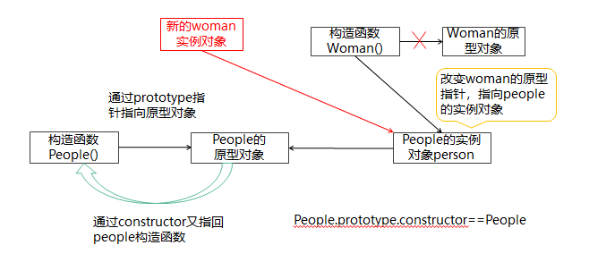

# 原型与原型链

### 原型的特点

每一个函数都有一个 prototype(原型属性)，这个属性就是一个指针，指向一个对象而这个对象的用途就是可以让所有对象实例共享它所包含的属性和方法，
这使得我们可以不必在构造函数中定义对象实例的信息，而是直接添加到原型中，这便是原型模式相对于构造函数来说的优点所在。

### 构造函数、原型与实例的关系

(1)每一个构造函数都有一个原型对象

(2)原型对象都包含指向构造函数的指针

(3)实例都包含一个指向原型对象的内部指针

通俗的说，实例可以通过内部指针访问到原型对象，原型对象可通过 constructor 找到构造函数。所有函数的默认原型都是 Object 的实例，因此默认原型都会包含一个内部指针，指向 Object.prototype。这也是所有自定义类型都会继承 toString()、ValueOf()等默认方法的根本原因。

### 原型链的定义与理解

原型链就是将一个类型的实例赋值给另一个构造函数的原型，利用原型让一个引用类型继承另一个应用类型的属性和方法。为了便于理解，我们可以从如下所示的示意图来看：

从图中可以看出，实现原型链的关键步骤在于将 Woman 构造函数的 prototype 指向了 People 实例对象覆盖了 woman 的原型对象。举个例子如下：

### 原型链的优缺点

- 优点:
 实现继承

- 缺点:
  
(1)原先的属性成为现在的原型属性，对于引用类型值的属性会影响每个实例；

(2)在没有办法不影响所有对象实例的情况下，不能向超类型的构造函数中传递参数在创建子类型的实例时。

为了解决这些问题，后面提出了借用构造函数、组合继承、原型式继承、寄生式继承以及寄生组合式继承等方法，各类方法都有各自的特点。其中使用最多的是组合继承，这种模式是使用原型链继承共享的属性和方法，通过借用构造函数继承实例属性；而寄生式组合继承则是集寄生式继承和组合继承的优点于一身，是实现基于类型继承的最有效方式。
