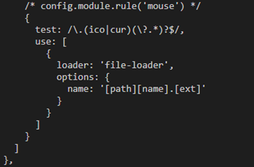

# Webpack与Vue CLI
## Webpack是什么

> Webpack是模块打包机，它本质是一种构架工具，它可以分析你的项目结构，找到JavaScript模块以及其它的一些浏览器不能直接运行的拓展语言（Scss，TypeScript等），并将其转换为可执行的JavaScript、CSS、HTML代码格式以供浏览器使用。

>Webpack是npm生态中的一个模块，webpack的运行依赖于node的环境，没有node是不能打包的。

## 构建工具产生背景

随着前端技术的快速发展，各种可以提高开发效率的思想和框架层出不穷。但他们都有一个共同点：源代码无法直接运行，必须转换后才可以正常运行。
构建就是做这件事情，将源代码转换成可执行的JavaScript、CSS、HTML代码，包括如下内容：

* **代码转换**：将TypeScript编译成JavaScript、将SCSS编译成CSS等。
* **文件优化**：压缩JavaScript、CSS、HTML代码，压缩合并图片等。
* **代码分割**：提取多个页面的公共代码，提取首屏不需要执行部分的代码让其异步加载。
* **模块合并**：在采用模块化的项目里会有很多歌模块和文件，需要通过构建功能将模块分类合并成一个文件。
*  **自动刷新**：监听本地原代码的变化，自动重新构建、刷新浏览器。
* **代码校验**：在代码被提交到仓库前需要校验代码是否符合规范，以及单元测试是否通过。
* **自动发布**：更新代码后，自动构建出线上发布代码并传输给发布系统。

为了更好的理解上面内容，可以看下图：


构建其实是工程化、自动化思想在前端开发中的体现，将一系列流程用代码去实现，让代码自动化的执行这一系列复杂的流程。

## 为什么选用Webpack?

历史上先后出现了一系列构建工具，常见有以下几种：
* **Npm Script和Grunt时代**：流程复杂，从而引入自动化思想，用于简化流程
* **Glup时代**：开始出现一些新语言用于提供开发效率，出现文件转换流程，如将ES5转换为ES6
* **Webpack时代**：由于单页应用的流行，网页的功能和实现代码变得复杂、庞大，Web开发向模块化改进。

各类构建工具都有各自的定位和专注点，它们之间既可以单独完成任务，也可以互相搭配来弥补各自的不足，我们应该根据自己的需求去选择和搭配。

经过多年发展，Webpack已经成为构建工具中的首选，原因有以下几点：

* 大多数团队在开发新项目时会采用紧跟时代的技术，这些技术都会采用“模块+新语言+新框架”，Webpack可以为这些新项目提供一站式的解决方案。
* Webapck有良好的生态链和维护团队，能提供良好的开发提亚并保证质量。
* Webpack被全世界大量的Web开发者使用和验证，能找到各个层面所需的教程和经验。

## Webpack作用原理
在Webpack中一切文件如JavaScript、CSS、SCSS、图片、模板等皆为模块，这样的好处是能清晰的描述各个模块之间的依赖关系，以方便Webpack对模块进行打包。通过Loader转换文件，使用Plugins扩展功能等处理，最后输出浏览器能使用的静态资源。为了方便理解，整理出Webpack的作用原理图：


Loader是在打包构建过程中用来处理源文件的，一次处理一个；Plugin并不直接操作单个文件，而是直接对整个构建过程起作用。

## Webpack配置

### 核心概念

**Entry**：入口，Webpack 执行构建的第一步将从 Entry 开始，可抽象成输入。<br/>
**Module**：模块，在 Webpack 里一切皆模块，一个模块对应着一个文件。Webpack 会从配置的 Entry 开始递归找出所有依赖的模块。<br/>
**Loader**：模块转换器，用于把模块原内容按照需求转换成新内容。<br/>
**Plugin**：扩展插件，在 Webpack 构建流程中的特定时机注入扩展逻辑来改变构建结果或做你想要的事情。<br/>
**Output**：输出结果，在 Webpack 经过一系列处理并得出最终想要的代码后输出结果。<br/>

### 基础配置
```js
const path = require("path");
const HtmlWebpackPlugin = require("html-webpack-plugin");
const { CleanWebpackPlugin } = require("clean-webpack-plugin");
const webpack = require("webpack");
const MiniCssExtractPlugin = require("mini-css-extract-plugin");

module.exports = {
// entry: './src/index.js',
entry: { app: "./src/index.js" },
// print: "./src/print.js"
output: {
 // filename: "bundle.js",
 filename: "[name].bundle.js", //name是指entry对象中的属性名，若没有定义属性名，则默认为main
 path: path.resolve(__dirname, "dist"), //所有输出文件的目标路径，必须是绝对路径
 // publicPath: "/", //webpack-dev-middleware自动编译方法所需配置内容，
 // 以确保中间件(middleware)功能能够正确启用，确保文件资源能够在自定义端口下下正确访问
 library: "result",
},
plugins: [
 new CleanWebpackPlugin(), //不能传参，否则会报错
 new HtmlWebpackPlugin({
  title: "output Management",
 }),
 new webpack.NamedModulesPlugin(), //方便更容易查看要修补(patch)的依赖
 new webpack.HotModuleReplacementPlugin(),
 new MiniCssExtractPlugin(),
],
module: {
 //根据正则表达式来确定查找哪些文件，并将其提供给指定的loader。
 rules: [
  {
   test: /\.css$/, //在这种情况下，以 .css 结尾的全部文件，
   use: ["style-loader", "css-loader"], //都将被提供给 style-loader 和 css-loader。
  },
  {
   test: /\.(png|svg|jpg|gif)$/,
   use: [
    {
     loader: "url-loader",
     options: {
     limit: 8192,
     },
    },
   ],
  },
  {
   test: /\.(woff|woff2|eot|ttf|otf)$/,
   use: ["file-loader"],
  },
  {
   test: /\.scss$/,
   use: [MiniCssExtractPlugin.loader, "css-loader", "sass-loader"],
  },
 ],
},
devtool: "inline-source-map", //inline-source-map可以明确指出发生错误的确切位置
// 提供一个简单的web服务器，实现自动编译并且可进行热更新
devServer: {
contentBase: "./dist", //告诉开发服务器(dev server)，在哪里查找文件
 },
};
```
### 配置策略
通常可用如下经验去判断如何配置 Webpack：

* 想让源文件加入到构建流程中去被 Webpack 控制，配置 entry。
* 想自定义输出文件的位置和名称，配置 output。
* 想自定义寻找依赖模块时的策略，配置 resolve（解析）。
* 想自定义解析和转换文件的策略，配置 module，通常是配置 module.rules 里的 Loader。
* 其它的大部分需求可能要通过 Plugin 去实现，配置 plugin。

## Vue CLI3是什么
> Vue CLI 是一个基于 Vue.js 进行快速开发的完整系统。它是通过 **@vue/cli**（@表示最新版本，老版本对应的是vue/cli）搭建交互式的**项目脚手架**。

>Vue CLI是**基于nodejs+webpack封装的命令行工具**，可以理解为汇集了各种命令的 bash或者bat。

> Vue CLI是一个运行时依赖 (@vue/cli-service)，该依赖是**基于 webpack 构建**，并带有合理的默认配置；可通过项目内的配置文件进行配置；可通过插件进行扩展。

使用@vue/cli命令搭建最新版本的vue-cli项目框架，搭建完成后在package.json文件中的会自动生成一下三个脚本命令：
```json
"scripts": {
  "serve": "vue-cli-service serve",
  "build": "vue-cli-service build",
  "lint": "vue-cli-service lint",
},
```
serve命令用于项目启动，build命令用于项目打包。执行build命令进行构建打包时，实际上就是webpack操做的。


## Vue CLI3项目配置
Vue CLI3为了能**减少开发者在非业务代码方面的消耗**，提供更好的工程演进体验，对webpack配置进行封装（node_moudles/@vue/cli-service/webpack.config.js），减去独立的webpack配置文件。只需在根目录创建vue.config.js文件，即可对webpack进行配置，并被 @vue/cli-service 自动加载。


**vue-cli4 全面配置** ：<a> https://github.com/staven630/vue-cli4-config#env </a>

### 基础配置
```js
module.exports = {
  // vue cli 3.3 之后使用publicPath代替原来的baseUrl,表示部署应用包时的基本URL，
  //与webpack本身的output.publicPath的一样.('/')表示根路径,（'./'）表示绝对路径
  publicPath: process.env.NODE_ENV === "development" ? "/" : "./",
  // outputDir为输出目录，默认为'dist'，与webpack本身的output.path一致
  outputDir: "dist",
  // 放置生成的静态资源 (js、css、../images、fonts) 的 (相对于 outputDir 的) 目录。
  assetsDir: "",
  // 指定生成的 index.html 的输出路径 (相对于 outputDir)。也可以是一个绝对路径。
  indexPath: "index.html",
  // 是否在开发环境下通过 eslint-loader 在每次保存时 lint 代码
  // 在生产构建时禁用eslint-loader
  // lintOnSave: process.env.NODE_ENV !== 'production'
  lintOnSave: true,
  // 所有 webpack-dev-server 的选项都支持
  devServer: {
    host: "0.0.0.0",
    port: 9096,
    open: true,
  },
}
```
### 自定义Webpack配置
封装，即意味着有个口留给用户，让用户去对底层进行自定义操作，在vue.config.js配置项中有两个入口，分别是chainWebpack和configureWebpack。

**chainWebpack**：类型只有Function类型，参数config是已经解析好的webpack配置。底层是 webpack-chain。

```js
chainWebpack: config => {
  // 别名
  config.resolve.alias
      .set("@", resolve("src"))
      .set("YZT", resolve("src/views/YZT"))
      .set("JDGL", resolve("src/views/JDGL"))
      .set("FZBZ", resolve("src/views/FZBZ"))
      .set("JCYJ", resolve("src/views/JCYJ"))
      .set("ZBMX", resolve("src/views/ZBMX"))
      .set("YWXT", resolve("src/views/YWXT"))
      .set("MXXT", resolve("src/views/MXXT"))
      .set("FZSC", resolve("src/views/FZSC"));

  // 鼠标指针样式
  config.module
      .rule("mouse")
      .test(/\.(ico|cur)(\?.*)?$/)
      .use("file-loader")
      .loader("file-loader")
      .options({
          name: "[path][name].[ext]"
      })
      .end();
 }
```

**configureWebpack**：两种类型，且这两种类型不能同时使用。

* Object类型：直接合并到最终配置，底层是webpack-merge.

    <!--  -->

```js
// 生产环境打包去除console.log
configureWebpack: {
  devtool: process.env.NODE_ENV === "development" ?
      "cheap-module-eval-source-map" : "source-map",
  optimization: {
      minimizer: [
          new UglifyJsPlugin({
              uglifyOptions: {
                  compress: {
                      warnings: false,
                      drop_console: false,
                      drop_debugger: true
                  }
              }
          })
      ]
  }
}
```

* Function类型：基于环境有条件的配置或直接修改配置，直接使用config参数去修改。

    <!--  -->
```js
configureWebpack: (config) => {
  if (process.env.NODE_ENV === "production") {
    // 为生产环境修改配置...
    config.mode = "production";
    // 这里修改下
    config.optimization.minimizer = [
      new UglifyJsPlugin({
        uglifyOptions: {
          compress: {
            warnings: false,
            drop_console: true, //console
            drop_debugger: true,
            pure_funcs: ["console.log"], //移除console
          },
        },
      }),
    ];
  } else {
    // 为开发环境修改配置...
    config.mode = "development";
  }
}
```

**二者区别** ：chainWebpack 是链式修改，一般用于修改webpack中层级比较深的配置（moudle）；写法优雅，逻辑清晰。
而configureWebpack 更倾向于整体替换和修改，一般用于自定义配置或修改插件。

## 审查Webpack配置

1）直接在终端查看所有Webpack配置：`vue inspect`<br/>
2）将其输出重定向到一个文件以便进行查阅：
（输出文件的格式没有要求，由于它输出的并不是一个有效的 Webpack 配置文件，而是一个用于审查的被序列化的格式，所以最好输出txt格式进行查看）。<br/>
根据配置的默认模式（development）输出：`vue inspect > output.js`<br/>
以生产模式（ production ）输出：`vue inspect --mode production >pro.ouput.txt`<br/>
3）查看所有规则和插件：`vue inspect --rules`<br/>
4）只审查第一条规则 、查看指定规则、查看指定插件<br/>
```
vue inspect module.rules[0]  //只审查第一条规则
vue inspect --rule vue    //查看定义vue组件的规则
vue inspect --plugin html //查看设置html模板插件
```


将项目的Webpack配置全部输出，形成如下目录结果：


通过vue inspect审查解析的Webpack配置文件中可以发现loader和plugin头部都会标识使用 chainWebpack 访问的方式。下面举例说明：

解析前：使用chainWebpack进行链式调用
<!--  -->
```js
// 鼠标指针样式
config.module
    .rule("mouse")
    .test(/\.(ico|cur)(\?.*)?$/)
    .use("file-loader")
    .loader("file-loader")
    .options({
        name: "[path][name].[ext]"
    })
    .end();
```
解析后：还原webpack原生写法（头部的注释config.module.rule('mouse')表明了使用chainWebpack时调用该loader的方式）
<!--  -->
```js
 /* config.module.rule('mouse') */
{
  test: /\.(ico|cur)(\?.*)?$/,
  use: [
    {
      loader: 'file-loader',
      options: {
        name: '[path][name].[ext]'
      }
    }
  ]
}
```


## 环境变量与模式

### 环境变量

#### 概念

我们先通过以下几个概念来了解一下什么是环境变量：

**process**：webpack是npm生态中的一个模块，它的运行依赖于node的环境，而process就是node中的全局变量，表示当前的node进程，作为一个对象，它对于 Node.js 应用程序始终是可用的，故无需使用 require()。<br/>
**process.env**：env是process的一个属性，包含着项目运行所在环境的一些信息，使用户可以根据不同的环境，做一些配置上的处理。比如开启 sourceMap，后端接口的域名切换等等。<br/>
**NODE_ENV**：是用户常用的自定义的变量，本身不存在于process.env中，它在webpack中是判断生产环境或开发环境的依据。（备注：NODE_ENV 这个名称只是开发社区的一种共识）

#### 定义方法
未使用vue-cli3构建项目前，我们可能会直接在package.json文件中脚本命令行中定义环境变量，如下图所示：


其中，**cross-env** 是运行跨平台设置和使用环境变量的脚本。 (兼容windows系统和mac系统)。**“scripts”** 是一个由脚本命令组成的hash对象，他们在包的不同生命周期中被执行。key是预定的一个指令名，value是要运行的脚本命令。然后在项目中的其它地方通过process.env.NODE_MODE便可查看当前项目运行环境。

使用vue-cli3构建项目之后，我们便可在项目根目录下创建.env.[模式]文件来定义一种模式，然后在这个文件中定义该模式特有的环境变量。一个模式（mode）可包含多个环境变量（NODE_ENV），每个模式都会将 NODE_ENV 的值设为模式的名称。其中声明的变量只会在使用该模式进行编译时被载入。

每一个环境变量文件中只包含环境变量的“键=值”对，所配置的变量中只有以VUE_APP_开头的变量才会被 webpack.DefinePlugin 静态嵌入到客户端侧包中。

除了VUE_APP_*变量外，还有两个特殊变量NODE_ENV 和 BASE_URL，在代码中始终可用。

>**NODE_ENV**：是 "development"、"production" 或 "test" 中的一个。具体的值取决于应用运行的模式。
>
>**BASE_URL**：会和 vue.config.js 中的 publicPath 选项相符，即你的应用会部署到的基础路径。

#### 使用方法

通过**process.env.[变量名]** 进行访问，从而获取到它的值。不过需要注意的是在项目的不同地方使用，限制也不一样。

在项目中，即src中使用环境变量的话，必须以VUE_APP_开头。如：在main.js中直接输出：`console.log(process.env.VUE_APP_SECRET)。`

在webpack配置中使用，没什么限制，可以直接通过process.env.XXX来使用。

在public/index.html中使用的：分三类：<br/>
   <%= VAR %>： 用于非转换插值 ，如：`<link rel="icon" href="<%= BASE_URL %>favicon.ico">`<br/>
   <%- VAR %>： 用于HTML转义插值<br/>
   <% expression %>： 用于JavaScript控制流 

### 模式
模式的作用就是通过配置mode选项，告知 Webpack 使用相应环境的内置优化。比如：vuex可以根据模式的不同，在development中自动注入devtoolPlugin插件，利于开发；而在production中检测到错误不会进行console。

Webpack中有三种模式，分别为：development、production（默认）、none(webpack4后就去掉了)。我们可以在webpack.config.js文件中对mode选项进行配置或直接在scripts脚本命令中直接使用‘--mode xxx’参数传递。

> **注意**： mode会影响NODE_ENV，但NODE_ENV不会影响mode。
如果没有设置mode，Webpack 会将 mode 的默认值设置为 production，则NODE_ENV 值也默认为production ；但是设置 NODE_ENV 并不会自动地设置 mode。

Vue CLI是基于Webpack构建的,所以vue-cli也包含相应的模式，默认情况下有以下三种模式：（比webpack本身多了一种test模式。）
```
development 模式： 用于 vue-cli-service serve 
production 模式： 用于 vue-cli-service build 和 vue-cli-service test:e2e
test 模式： 用于 vue-cli-service test:unit
```
开发模式和生产模式应用场景：


### 实例应用
1）新增.env.test文件，并在该文件夹下设置相关环境变量。


2）在vue.config.js文件中使用环境变量。


3）在package.json文件下的"scripts"脚本命令行中增加test命令，并通过mode参数这是编译模式。


4）执行test命令，生成打包文件。

