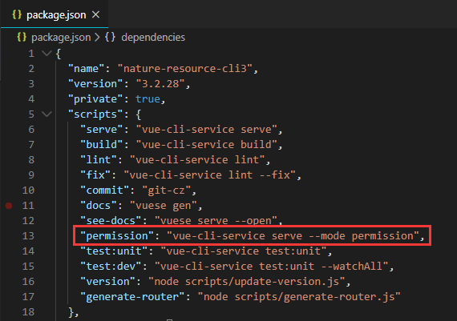
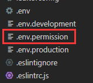
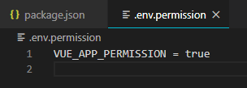
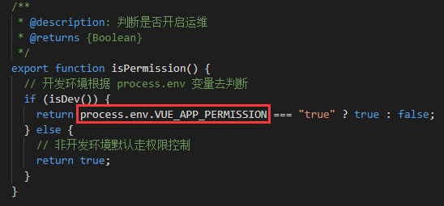

# vue-cli3 中自定义环境变量和模式配置

## 为什么需要配置环境变量和模式呢？

所有方法肯定是来源于现实的需求。在一个产品的前端开发过程中，一般来说会经历本地开发、测试脚本、开发自测、测试环境、预上线环境，然后才能正式的发布。对应每一个环境可能都会有所差异，比如说用户访问资源权限、服务器地址、接口地址等。在各个环境切换的时候，就需要不同的配置参数，所以就可以用环境变量和模式，来方便我们管理。

## 环境变量

**1）环境变量文件分类：**

在 vue-cli3 中可以在根目录（与 package.json 同级）中创建以下四种类型的环境变量文件：

```
.env                # 在所有的环境中被载入
.env.local          # 在所有的环境中被载入，但会被 git 忽略
.env.[mode]         # 只在指定的模式中被载入
.env.[mode].local   # 只在指定的模式中被载入，但会被 git 忽略
```

值得注意的是，为一个特定模式准备的环境文件的（如：.env.production）将比一般的环境文件（如：.env）拥有更高的优先级。

**2）环境变量配置**

每一个环境变量文件中只包含环境变量的“键=值”对，所配置的变量中只有以`VUE_APP_`开头的变量才会被 webpack.DefinePlugin 静态嵌入到客户端侧包中，如：

```
VUE_APP_PERMISSION = true
```

**3）环境变量访问**

被载入和变量将会对 vue-cli-service 的所有命令、插件和依赖可用。在应用代码中通过`process.env.[变量名]`进行访问，从而获取到它的值，如下：

```
 if (isDev()) {
    return process.env.VUE_APP_PERMISSION === "true" ? true : false;
  }
```

> 除了  **VUE*APP*** 变量之外，在你的应用代码中始终可用的还有两个特殊的变量：
>
> （1）**NODE_ENV** ：会是  "development"、"production"  或  "test"  中的一个。具体的值取决于应用运行的模式。
>
> （2）**BASE_URL** ：会和  vue.config.js  中的  publicPath  选项相符，即你的应用会部署到的基础路径。
>
> 所有解析出来的环境变量都可以在  public/index.html  中使用，如下：
> `<link rel="icon" href="<%= BASE_URL %>favicon.ico" />`

## 模式

**1）模式分类**

在 vue-cli 中默认情况下有以下三种模式：

```
development 模式：  用于 vue-cli-service serve
production 模式：   用于 vue-cli-service build 和 vue-cli-service test:e2e
test 模式：         用于 vue-cli-service test:unit
```

模式与环境变量不同，一个模式可包含多个环境变量（NODE_ENV），每个模式都会将 NODE_ENV 的值设为模式的名称。

**2）模式定义与使用**

你可以通过为  .env  文件增加后缀来设置某个模式下特有的环境变量。比如，如果你在项目根目录创建一个名为  .env.development  的文件，那么在这个文件里声明过的变量就只会在 development 模式下被载入。

也可以通过传递  --mode  选项参数为命令行覆写默认的模式。例如，如果你想要在构建命令中使用开发环境变量，则需在  package.json  脚本中设置：

```
"build": "vue-cli-service build --mode development",
```

## 结合实际应用

针对我们公司的项目来说，每个项目都设置了三种模式，分别为 development、production 和 permission。我们都知道前两个是 vue-cli 项目中默认有的模式，那么 permission 模式便是我们在项目上自定义的，为什么要自定义这个模式呢？

作为非产品设计和开发人员，我们或许并不是很清楚这个模式产生的根本原因，那么我们先来看看项目上是怎么配置和应用这个模式，从而来了解它的作用。

首先在 package.json 添加一种类型，并修改默认环境变量为 permission 环境变量:


在根目录下创建.env.permission 文件，来定义变量和值：




如上图所示，定义了一个.env.permission 文件，并在该文件中设置`VUE_APP_PERMISSION`变量，并为其复制为 true。（ 在 src 文件夹下的任意文件中都可以关联到`process.env.NODE_ENV`环境变量）

然后找到该变量引用的地方，如下所示：


从上图便可看出，`VUE_APP_PERMISSION`环境变量影响着该系统是否开启运维模式，即权限管理模式。当系统通过`yarn permission`命令运行时，则进入权限控制模式，需要进行登录验证，并根据登录用户获取相应的资源。

**这里需要特别注意的是，每种环境变量只有在所对应的模式被编译执行的时候才能被读取，也就是说，如果我在 permission 模式下执行编译，那就只能读取该模式下的变量，而不能读取 development 和 production 或其他模式中所设置的环境变量。所以如果在开发模式下进行编译，那么就无法读取到 permission 模式下的`VUE_APP_PERMISSION`变量。这也保证了不同模式编译结果的唯一性。**

由此可见，当我们执行`yarn serve`的时候走的是 development 模式，而该模式中并未定义`VUE_APP_PERMISSION`环境变量，所以 isPermission()为 false，即不走权限控制。所以如果要走权限控制，对资源进行权限管理，那么就需要对 permission 模式进行编译。
